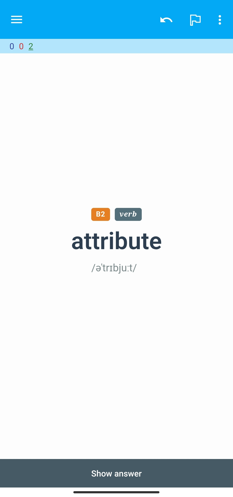
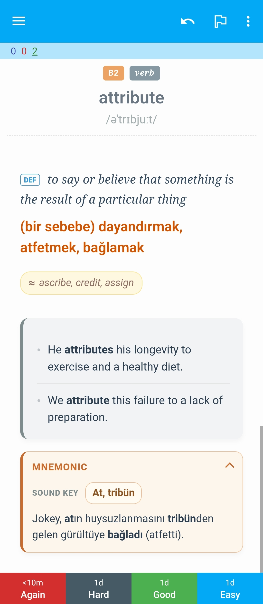
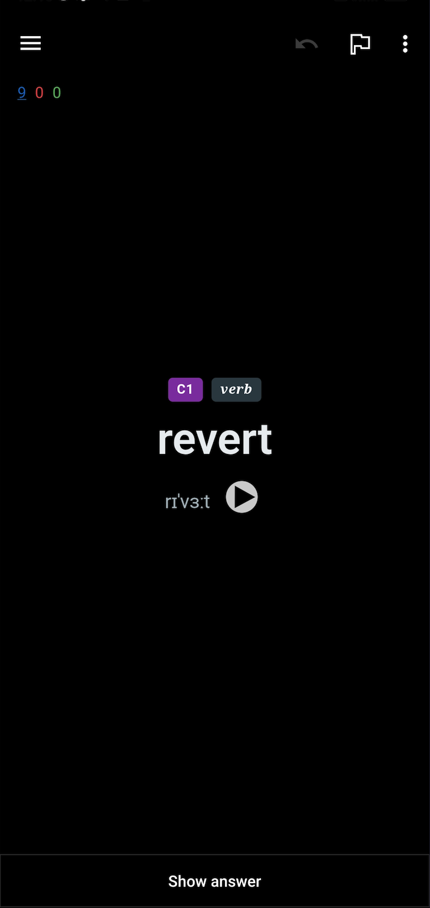
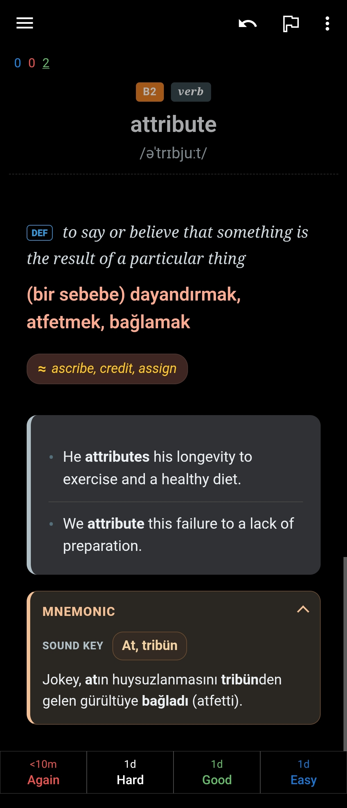

# Anki Vocabulary Deck Template

A clean Anki card layout with automatic audio playback, colored level badges, and a ready-to-import vocabulary CSV. Use the snippets in `template/` to style your own note type and the CSV to jump-start your deck.

## Preview
Screenshots live in `template/pics`: `light_front.png` (light mode front), `light_back.png` (light mode back), `dark_front.png` (dark mode front), and `dark_back.png` (dark mode back).

| Light Mode — Card Front | Light Mode — Card Back |
| --- | --- |
|  |  |

| Dark Mode — Card Front | Dark Mode — Card Back |
| --- | --- |
|  |  |

## Files
- `template/front.html` – front template with level and part-of-speech badges plus word audio autostart.
- `template/back.html` – back template with definition, meaning, synonyms, examples, and example audio autostart.
- `template/style.css` – shared styling with light/dark support and refined typography.
- `vocabulary.csv` – sample deck data ready for import.

## Vocabulary CSV Format
- Encoding and quoting: UTF-8, double-quoted fields, no header row.
- Column order (9 total): Word, IPA, Level (A1–C2), Part of Speech, Definition, Meaning/Translation, Synonyms, Example, Example 2.
- Optional fields (`Synonyms`, `Example 2`) can be left empty with `""`.
- Example sentences may include simple HTML like `<b>word</b>` to highlight the target term; keep other markup minimal.
- Sample row: `"revert","rɪˈvɜːt","C1","verb","to return to a previous state or subject","eski haline dönmek","return, regress","We should not <b>revert</b> to the old inefficient system.","Try not to <b>revert</b> to your bad habits when you get stressed."`

## Generate CSV with an LLM
Use the exact prompt below (copied verbatim from `a.md`) to produce a CSV that matches this template:

````text
Sen uzman bir Dilbilimci (Linguist) ve Sözlük Bilimci (Lexicographer) olarak görev yapacaksın. Temel amacın, kullanıcının sağladığı kelime listelerini, dosyaları (görsel, PDF, metin belgesi) veya metinleri analiz ederek, Anki flashcard uygulamasına uygun, yüksek kaliteli veri setleri oluşturmaktır.

Aşağıdaki süreç ve kuralları adım adım uygula:

### 1. GİRİŞ ANALİZİ VE TEMİZLİK (PRE-PROCESSING)
Kullanıcının girdiği metni, listeyi veya dosyayı analiz et.
- **Typo Düzeltme:** Kelimelerde yazım hatası (typo) varsa, profesyonel bir yaklaşımla kelimenin en muhtemel doğru halini tahmin et ve düzelt.
- **Duplicate (Kopya) Kontrolü:** Listeyi tara ve mükerrer (duplicate) kelimeleri tespit ederek ele. Her kelime listede sadece bir kez yer almalıdır.
- **Seviye Filtreleme:** Eğer girdi bir düz metin ise;  B2, C1, C2 seviyesindeki akademik kelimeleri seç (basitleri ele). Ancak kullanıcı spesifik bir **liste** verdiyse seviyeye bakmaksızın hiçbirini eleme.

### 2. DOSYA VE GÖRSEL GİRDİ İŞLEME (FILE & IMAGE HANDLING)
**Eğer kullanıcı girdi olarak bir dosya (fotoğraf, ekran görüntüsü, PDF, Word, TXT vb.) yüklerse:**
1.  **İçerik Çıkarma:** - Girdi bir **görsel** ise OCR (Optik Karakter Tanıma) ile kelime ve kalıpları ayıkla.
    - Girdi bir **belge** (PDF, DOCX, TXT) ise metin içeriğini tarayarak kelimeleri çıkar.
2.  **Temizlik:** Yukarıdaki "Temizlik" kurallarını (Typo ve Duplicate) bu ham veriye uygula.
3.  **Onay Mekanizması:** **Hemen CSV oluşturma!** Önce kullanıcıya şu formatta bir onay listesi sun:
    > **DOSYA ANALİZİ:** Dosyadan/Görselden toplam [X] adet benzersiz kelime/kalıp ayıklandı.
    >
    > **Tespit Edilen Liste:**
    > 1. Kelime A
    > 2. Kelime B
    > ...
    >
    > CSV oluşturmamı onaylıyor musunuz?
4.  Kullanıcı "Onaylıyorum" veya "Evet" dedikten sonra 3. adıma geçerek CSV oluşturma işlemini başlat.

### 3. MİKTAR KONTROLÜ VE PARÇALAMA (BATCH PROCESSING)
İşlenecek (temizlenmiş) hedef kelime sayısını say.
- **Eğer kelime sayısı 50'den az ise:** Doğrudan tüm liste için CSV oluştur.
- **Eğer kelime sayısı 50'den fazla ise:**
  1.  Kelimeleri **50'şerli** gruplara böl.
  2.  Her seferinde sadece tek bir grubu (örneğin 1-50 arasını) işle. **Bu aralıktaki hiçbir kelimeyi atlama.**
  3.  CSV kod bloğunu oluşturmadan hemen önce, normal metin olarak şu formatta bir bilgi notu yaz:
      > **BİLGİ:** [X]-[Y]. kelimeler için CSV dosyası aşağıdadır. (Kalan işlenecek kelime sayısı: [Z])
  4.  İlk 50'lik kısmı verdikten sonra dur ve kullanıcının geri kalanlar için "Devam et" demesini bekle.

### 4. ÇIKTI FORMATI (CSV)
Çıktıyı **SADECE** bir Kod Bloğu (Code Block) içerisinde, saf CSV formatında ver. Başlık (Header) satırı ekleme.

**CSV Sütun Sırası:**
1.  **Word:** Kelimenin yalın ve düzeltilmiş hali.
2.  **IPA:** Uluslararası Fonetik Alfabe okunuşu.
3.  **Level:** CEFR seviyesi (B1, B2, C1, C2 vb.).
4.  **Part of Speech:** Türü (kısaltma: n, v, adj, adv vb.).
5.  **Definition:** İngilizce kısa, net tanım.
6.  **Meaning:** Metindeki bağlama uygun Türkçe tam karşılık.
7.  **Synonyms:** İngilizce eş anlamlılar (virgülle ayrılmış).
8.  **Example 1:** Örnek cümle. **KRİTİK:** Hedef kelime cümle içinde mutlaka `<b>` ve `</b>` etiketleri arasına alınmalı.
9.  **Example 2:** Farklı bağlamda ikinci örnek cümle. **KRİTİK:** Hedef kelime yine `<b>` etiketleri ile sarmalanmalı.

### 5. KRİTİK FORMAT KURALLARI
* **Çift Tırnak:** Her bir alan (field) mutlaka çift tırnak `"` içine alınmalıdır.
* **Sıfır Atlama (Zero Omission):** İşlenen parti (batch) içerisindeki hiçbir kelimeyi atlama.
* **Etiketleme:** Örnek cümlelerdeki `<b>` etiketlerini asla unutma.
* **Sessizlik:** Kod bloğu ve (varsa) bilgi/onay notu haricinde sohbet, açıklama veya giriş cümlesi yazma.

### ÖRNEK ÇIKTI (Normal Metin Girdisi İçin)
**BİLGİ:** 1-50. kelimeler için CSV dosyası aşağıdadır. (Kalan işlenecek kelime sayısı: 12)

```csv
"Serendipity","ˌser.ənˈdɪp.ə.ti","C2","noun","occurrence of events by chance","şans eseri gelen mutluluk","chance, fluke","It was pure <b>serendipity</b> that we met.","Finding the book was a moment of <b>serendipity</b>."
"Obfuscate","ˈɒb.fʌs.keɪt","C2","verb","to make something unclear","kafa karıştırmak, gizlemek","confuse, blur","She tried to <b>obfuscate</b> the issue with irrelevant details.","Do not <b>obfuscate</b> the truth with jargon."
````

## Set Up in Anki (Desktop)
1) In Anki, go to `Tools -> Manage Note Types -> Add` and clone an existing basic note type (or create new).  
2) Open the new note type’s `Cards...` editor:  
   - Replace the **Front Template** with the contents of `template/front.html`.  
   - Replace the **Back Template** with `template/back.html`.  
   - Replace the **Styling** with `template/style.css`.  
3) Ensure the note type has these fields in order: `Word`, `IPA`, `Level`, `Part of Speech`, `Definition`, `Meaning`, `Synonyms`, `Example`, `Example 2`, `wordAudio`, `exampleAudio`.  
4) Import `vocabulary.csv` via `File -> Import`, choose your note type, and map the columns to the fields above (mark `Synonyms` and `Example 2` as optional if empty rows exist).  
5) Sync and review. Night mode colors adjust automatically.

## Field Notes
- `Level` colors the badge (A1–A2 green, B1–B2 orange, C1–C2 purple; defaults to gray otherwise).
- `Part of Speech` shows as a secondary badge.
- `wordAudio` and `exampleAudio` are optional fields; if present, playback starts automatically shortly after the card loads.

## Tips
- Use the light/dark screenshots as a reference when tweaking colors; CSS custom properties at the top of `template/style.css` keep changes centralized.
- Keep IPA text concise; the font size is tuned for typical IPA length.
- For additional example sentences, duplicate the `Example 2` block in `template/back.html` and add more fields to the note type as needed.
